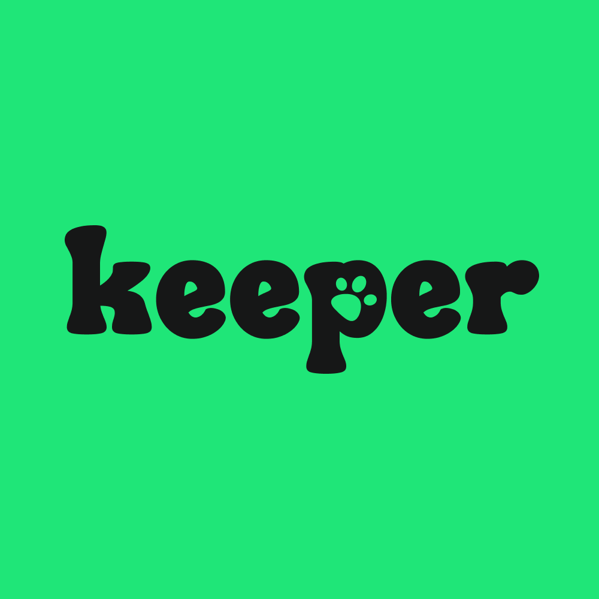

# 🐾 KEEPER - 유기동물 입양 공고 앱

  

> 유기동물 입양에 관심 있는 사람들이 더 쉽고 빠르게 정보를 접할 수 있도록 도움을 주는 앱입니다.

## 📱 앱 다운로드

<!--  -->

> Android 버전은 현재 심사 중입니다.

---

## 📌 개요

- **프로젝트 기간**: 2024.05 ~
- **팀 구성**: 총 3명 (디자이너, 백엔드 개발자, 프론트엔드 개발자)
- **기여도**: 팀 구성, 기획, 앱 개발 및 스토어 배포 관리, 운영 (기여도 70%)
- **마이그레이션 및 기능 구현을 이어 나가고 있습니다**

---

## ✨ 주요 기능

- 유기동물 입양 공고 리스트 및 상세 조회
- 보호소 정보 확인 및 연락처 복사
- 지역 및 동물 종류 필터링 기능

---

## 🛠 기술 스택

- **Frontend**: React Native, TypeScript, Jotai, TanStack Query
- **Backend**: AWS, NestJS, MySQL
