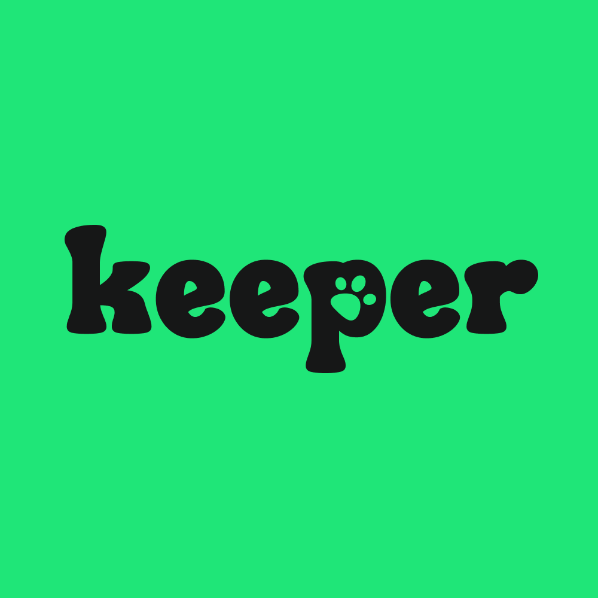

# 🐾 KEEPER - 유기동물 입양 공고 앱

  

> 유기동물 입양에 관심 있는 사람들이 더 쉽고 빠르게 정보를 접할 수 있도록 도움을 주는 앱입니다.

## 📱 앱 다운로드

 

---

## 📌 개요

- **프로젝트 기간**: 2024.05 ~
- **팀 구성**: 총 2명 (디자이너, 개발자)
- **마이그레이션 및 기능 구현을 이어 나가고 있습니다**
