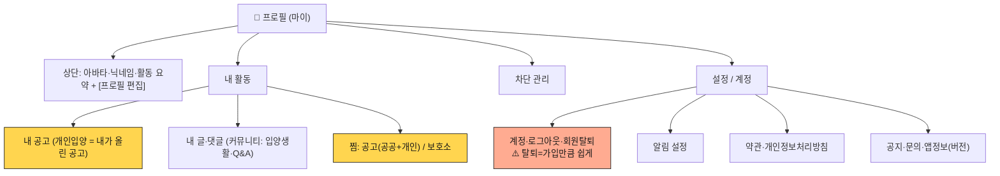

# 프로필(마이) 기획

> 작성일: 2026-06-04 · 딥리서치 반영
> IA 위치: [[ia-redesign]] §5 "프로필 — 마이 축" 의 상세 기획.
> 원칙: keeper 역할 경계(정보·연결) — **게임화(포인트·레벨·배지) X**, 신뢰는 누적 카운트 수준의 자연 신호만.
> 기존 상세: `00-profile-block-list.md`(차단), `00-profile-like.md`(찜) 흡수·참조.

---

## 0. 딥리서치 핵심 (검증된 BP)

- 프로필 = **상단 정체성(아바타·닉네임·활동 요약) → 하단 2차 콘텐츠(내 활동·찜)** 위계. (AND Academy / Nike Training 패턴)
- 설정은 **preferences 전용** — 앱정보(버전)·계정관리는 설정에서 빼서 별도. **"잡동사니 서랍(junk drawer)" 안티패턴 회피**, 논리 그룹핑. (Material Design 원전 / NN/g)
- 빈 화면은 **first-use / user-cleared / no-results 3종 구분** + 시스템 상태·학습 단서·진입 경로. (NN/g empty state)
- **게임화 PBL은 성과만 올리고 내재 동기엔 영향 없음** → keeper 게임화 컷 결정과 정합, 누적 카운트로 충분. (Mekler 2013)
- ⚠️ **회원탈퇴는 가입만큼 쉬워야 함** — 전자상거래법 §21조의2(2025-02-14 시행), 가입보다 복잡한 탈퇴·방법 제한 = 다크패턴 위반. (법령·공정위)
- (주의) "리스트 기본 + 지도 토글"은 store-locator 기준 — keeper 보호소는 **지도 우선이 의도된 발견 캔버스**라 그대로 유지(맥락 다름).
- (refuted) "프로필 vs 설정 별개 개념 분리", 고정 4/6분류 템플릿은 보편 규칙 아님 — **그룹핑 원리만 차용, 구체 카테고리는 사례**.

---

## 1. 목표 IA

---

## 2. 보유로 정리 vs 신규

| 항목                            | 현재       | 처리                                                             | 비고                                      |
| ------------------------------- | ---------- | ---------------------------------------------------------------- | ----------------------------------------- |
| 찜(`like`)                      | 단일       | **출처 분리(공고 공공+개인 / 보호소)** + 위치를 내 활동 하단으로 | 신규(분리)                                |
| 차단(`blocks`)                  | 있음       | 안전/계정 영역으로 편입                                          | 보유                                      |
| 계정·탈퇴(`account`)            | 있음       | **탈퇴 가입만큼 쉽게** 점검                                      | 보유 + 법규 확인                          |
| 닉네임 변경(`account/nickname`) | 무제한     | **30일 쿨타임**(신뢰 식별자 보호 — 신고/차단 회피·작성자 추적)   | 신규(정책) · [[nickname-change-cooldown]] |
| 앱정보(`app-info`)              | 있음       | 설정 밖 별도(버전) 유지                                          | 보유                                      |
| 문의(`inquiry`)·공지(`notice`)  | 있음       | 설정 그룹으로 묶기                                               | 보유                                      |
| **내 활동**(내 공고·내 글·댓글) | 없음       | 탭 모아보기 신설                                                 | 신규 (F-03)                               |
| **알림 설정**                   | 없음       | 푸시 인프라(P1)와 함께                                           | 신규                                      |
| **empty state**                 | 일반 blank | 3종 상황별 설계                                                  | 신규                                      |

**핵심**: 개인입양=공고이므로 프로필에서도 **"내 글"이 아니라 "내 공고"**. 찜도 공고/보호소 출처로 분리.

---

## 3. ⚠️ 회원탈퇴 — 출시 전 법규 확인 (P0)

전자상거래법 §21조의2 제1항 제4호(2025-02-14 시행): **가입보다 복잡한 탈퇴·방법 제한은 다크패턴 위반.** 공정위 2025 점검에서 "가입보다 복잡한 탈퇴"가 단일 최다 적발.

- [ ] keeper 회원탈퇴(`account/withdraw`)가 **가입만큼 쉬운 단계·동일 채널(인앱)** 인지 점검
- [ ] confirm-shaming(죄책감 유발 문구)·마찰 증가(로치 모텔) 없는지 점검
- → 현재 `withdraw` 라우트 존재. **단계 수·문구만 점검하면 됨** (대공사 아님). 출시 전 체크리스트 포함.

---

## 4. Empty state 3종 (keeper 매핑)

| 상황         | keeper 화면        | 카피 방향                                    |
| ------------ | ------------------ | -------------------------------------------- |
| first-use    | 빈 찜 · 빈 내 활동 | "관심 공고를 저장해보세요" + [공고 보러가기] |
| no-results   | 검색·필터 무결과   | "조건에 맞는 공고가 없어요" + [조건 변경]    |
| user-cleared | 다 비운 목록       | 채우는 경로 재안내                           |

→ 장식 일러스트만 두지 말 것. **무엇이 뜨고 어떻게 채우는지** 안내 + 진입 버튼 필수.

---

## 5. 단계

| 단계             | 작업                                                                                                                                                       |
| ---------------- | ---------------------------------------------------------------------------------------------------------------------------------------------------------- |
| **출시 전 (P0)** | 회원탈퇴 법규 점검(가입만큼 쉽게·confirm-shaming 제거) · 기존 항목 그룹핑 정리(설정 잡동사니 회피) · 닉네임 변경 30일 쿨타임([[nickname-change-cooldown]]) |
| **P1 (출시 후)** | 내 활동(내 공고·글·댓글) 모아보기(F-03) · 찜 출처 분리(F-04) · empty state 3종 · 알림 설정(푸시 인프라와)                                                  |
| **선택**         | 누적 카운트(입양 도움·임보·후기·작성 수) 신뢰 신호 — 게임화 X                                                                                              |

---

## 출처

- Material Design Settings 패턴 · NN/g(empty state·마이페이지 안티패턴·mobile maps) · AND Academy(프로필 UI 위계)
- 전자상거래법 §21조의2(2025-02-14) · 공정위 다크패턴 점검 · KCI 한국 카드앱 탈퇴 다크패턴 논문
- Mekler et al. 2013(게임화 PBL ↔ 내재동기)
