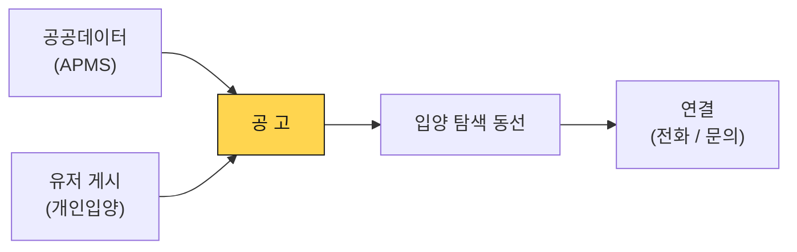
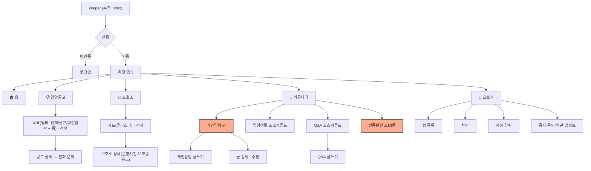
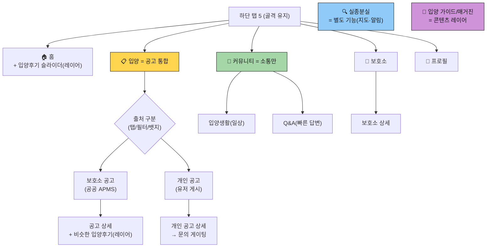
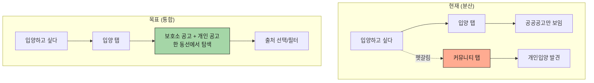

# keeper 정보 구조(IA) 재정리

> 작성일: 2026-06-04
> 목적: "진입점 2 → 공고 1" 원리로 메뉴·유저 플로우를 정리. 설계는 지금 확정, 구현은 단계적.
> 전제: keeper = 정보·발견·커뮤니티·연결 플랫폼 (입양 집행·자동화 아님). [[역할 경계]] 참조.

---

## 0. 근본 원리 — 진입점은 둘, 귀결은 하나

데이터가 들어오는 입구는 둘이지만, 사용자에게는 결국 **"공고"** 라는 하나의 개념으로 도달한다.

**함의**: 개인입양은 "커뮤니티"가 아니라 **출처가 유저인 공고**다. → 입양 탐색 동선에 통합되어야 한다. 커뮤니티는 "공고가 아닌 소통"만 남긴다.

---

## 1. 현재 IA (코드 라우트 기준)

(✅ 구현 / ⚠️ 미완) · `adoption_review`(입양후기)는 백엔드만 있고 화면 없음.

---

## 2. 문제점

| 문제               | 설명                                                                                   |
| ------------------ | -------------------------------------------------------------------------------------- |
| **입양 동선 분산** | 공공공고(입양 탭) ↔ 개인입양(커뮤니티 탭)이 다른 메뉴 — 같은 "입양 찾기"인데 경로가 둘 |
| **커뮤니티 혼재**  | 소통(입양생활·Q&A) + 공고(개인입양) + 제보(실종분실)가 한 탭에 섞임                    |
| **콘텐츠 미배치**  | 입양후기(사회적 증명)·행동 가이드가 둘 곳이 없어 방치                                  |

---

## 3. 목표 IA

- **입양 탭** = 공공 + 개인 공고 통합(출처는 탭/필터/뱃지로 구분, 데이터·법적 차이 유지)
- **커뮤니티 탭** = 입양생활 + Q&A (순수 소통)
- **입양후기·가이드** = 메뉴가 아니라 홈·공고 상세에 노출되는 **콘텐츠 레이어**
- **실종분실** = 입양과 목적이 다른(재회) **별도 기능**

---

## 4. 유저 플로우 변화 — "개인입양으로 입양하고 싶다"

→ 핵심 UX 변화: 입양 의도를 가진 사용자가 **한 탭에서 모든 공고를 본다.** 커뮤니티를 따로 뒤질 필요가 없다.

---

## 5. 변경 단계 (설계는 지금, 구현은 단계적)

| 단계                 | 작업                                                                                       | 무게 | 유저플로우/UI 영향        |
| -------------------- | ------------------------------------------------------------------------------------------ | ---- | ------------------------- |
| **설계 (지금)**      | 이 IA 맵 확정                                                                              | —    | 기준선 확보               |
| **출시 전 (가벼움)** | 커뮤니티를 "소통"으로 명확화(입양후기·가이드 안 섞기) · 개인입양 면책/문의 게이팅(법규 P0) | 작음 | 거의 현 상태              |
| **출시 후 A (중간)** | 입양후기 → 홈/공고 상세 노출 · Q&A/입양생활 오픈                                           | 중간 | 콘텐츠 레이어 추가        |
| **출시 후 B (큼)** ★ | **개인입양 → 입양 탭 통합**(출처 구분 UI) · 실종분실 별도 기능 분리                        | 큼   | **입양 탐색 동선 재설계** |
| **출시 후 C**        | 입양 가이드/매거진, 사용자 간 메시징(게이팅)                                               | 중간 | 신규 화면                 |

→ **무거운 동선 재설계(B)는 출시 후 메이저 단위**. 단 **설계(이 문서)를 지금 확정**해야 그때 깔끔하게 옮겨진다.

---

## 6. 역할 경계 (이 IA의 전제)

- ✅ keeper가 하는 것: 발견·정보·판단 보조·연결 진입점
- ❌ 안 하는 것: 입양 심사·성사 보증·거래 중개·자동 매칭 결정·보호소 운영 대행
- → 공고 통합도 "탐색 동선 통합"이지 "거래 처리 통합"이 아니다. 커뮤니티도 "소통"이지 "입양 처리"가 아니다.

---

## 변경 이력

- 2026-06-04: 최초 작성 — "진입점 2 → 공고 1" 원리, 현재/목표 IA, 유저 플로우, 단계 정의
