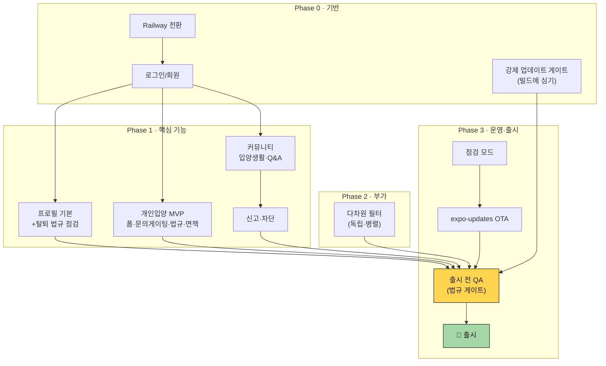

# 이번 출시 계획 — 로그인 + 개인입양·커뮤니티

> 작성일: 2026-06-04
> 테마: **정보 앱 → 참여형 입양 플랫폼 1단계** (로그인·회원 + 개인입양 + 커뮤니티 소통 추가, EC2→Railway 백엔드 전환 동반)
> 전제: keeper 역할 경계(정보·연결, 집행 아님) · IA 원리(진입점 2→공고 1). [[ia-redesign]] · [[product-roadmap]] 참조.

---

## 1. 스코프 — 확정

### ✅ 포함 (P0, 이번 출시)

| 항목                                 | 비고                                                                                                                |
| ------------------------------------ | ------------------------------------------------------------------------------------------------------------------- |
| **로그인/회원**(소셜) · 프로필 기본  | Railway 백엔드 의존                                                                                                 |
| **개인입양 MVP**                     | 잘 만든 폼(성격태그·영상·구조사연·임보조건) + 문의 게이팅 + 법규(금액란X·연락처 본문노출X·신고·면책 고지·민감정보X) |
| **커뮤니티 입양생활·Q&A 오픈**       | 소통(스캐폴드 활용). Q&A=빠른 답변, 입양생활=일상                                                                   |
| **신고·차단 화면**                   | 정보통신망법 §44조의2 (신고→삭제·임시조치)                                                                          |
| **다차원 필터**                      | 성별/나이/크기/중성화/지역 — 데이터·표시 있고 필터링만 추가(가성비)                                                 |
| 🏗️ **Railway 전환**                  | EC2 무중단 유지하며 전환                                                                                            |
| 🏗️ **점검 모드 (진입 막기)**         | 서버 점검/장애 시 닫을 수 없는 점검 화면 (원격 플래그) — 운영 비상 스위치                                           |
| 🏗️ **강제 업데이트 버전 게이트**     | ⭐ 소급 적용 불가 → **이번 빌드에 반드시**. min-version + soft/hard                                                 |
| 🏗️ **expo-updates (EAS Update) OTA** | JS/에셋 무중단 패치 채널. 핫픽스용. (네이티브 변경·호환 깨짐은 강제 게이트가 담당)                                  |

### ✅ 자동 포함 (이미 구현)

공공 공고(목록·필터·검색·상세·전화 문의) · 보호소(지도·검색·상세·운영시간) · 찜.

### ⏭️ 연기 (P1, 출시 후)

입양후기 노출 · 프로필 정리(찜 2탭·내 활동) · 푸시 알림+D-day · 채팅 · **공고 통합(개인입양→입양탭)** · 매칭 퀴즈 · 통계 대시보드 · 실종분실.

> **공고 통합은 이번에 안 함** — IA 설계는 확정했으나 동선 재설계가 무거워 P1. 이번엔 개인입양을 커뮤니티에 둔 채 출시.

---

## 2. 구현 순서 (자연스러운 흐름)

**기반 → 핵심 기능 → 부가 → 운영·출시** 순. 아래로 갈수록 앞 단계에 의존.

| Phase            | 작업                                                                                    | 왜 이 순서                                                                                 |
| ---------------- | --------------------------------------------------------------------------------------- | ------------------------------------------------------------------------------------------ |
| **0. 기반**      | ① Railway 전환(EC2 무중단) → ② 로그인/회원 → ③ 강제 업데이트 게이트                     | 백엔드·인증은 모든 유저 기능의 전제. 게이트는 빌드에 심어야 소급 가능(가장 먼저 빌드 레벨) |
| **1. 핵심**      | ④ 프로필 기본(+탈퇴 법규 점검) → ⑤ 개인입양 MVP → ⑥ 커뮤니티 입양생활·Q&A → ⑦ 신고/차단 | 로그인 위에 얹힘. 신고/차단은 UGC(개인입양·커뮤니티) 다음                                  |
| **2. 부가**      | ⑧ 다차원 필터                                                                           | 기존 공고에 부착, 독립 → 아무 때나 병렬 가능                                               |
| **3. 운영·출시** | ⑨ 점검 모드 → ⑩ expo-updates OTA 채널 → ⑪ 출시 전 QA(법규 게이트) → 🚀 출시             | 운영 스위치 정비 후 QA, 마지막 출시                                                        |

---

## 3. 출시 전 필수 게이트 (체크리스트)

**법규 (개인입양 — P0):**

- [ ] 금액(책임비) 입력란 없음
- [ ] 연락처 본문 노출 X → 문의 시 게이팅 노출
- [ ] 면책 고지 (이용약관 + 개인입양 화면 1줄 + 안전 배너)
- [ ] 신고·삭제·임시조치 기능 + 양 당사자 통지 (정보통신망법)
- [ ] 민감정보(주민번호 등) 미수집
- [ ] **회원탈퇴 가입만큼 쉽게** (전자상거래법 §21조의2, 2025-02-14) — 단계·문구 점검, confirm-shaming/마찰 증가 제거

**인프라 (운영 3종 + Railway):**

- [ ] **점검 모드(진입 막기)** — 원격 플래그(서버 config/status) → 부트스트랩 시 조회 → 닫을 수 없는 점검 화면
- [ ] **강제 업데이트 버전 게이트** (소급 불가 — 반드시 이번 빌드) — min-version API + 부트스트랩 버전 비교 + soft/hard + 스토어 이동
- [ ] **expo-updates(EAS Update) OTA** — 핫픽스 패치 채널 설정(runtimeVersion, 채널) + 부팅 시 업데이트 확인
- [ ] Railway 전환, EC2 무중단 확인

---

## 4. 인프라·운영 (병행)

- **Railway 백엔드 전환** — 운영 중 EC2(공공데이터 제공) 유지하며 로그인·커뮤니티 신규를 Railway로. `service-ops-infra.md` 참조.
- **운영 3종 (이번 출시 P0)** — 역할 분담이 핵심:
  - **점검 모드** = 서버 점검/장애 시 _진입 차단_ (닫을 수 없는 화면)
  - **강제 업데이트 게이트** = 네이티브·호환 깨짐 시 _구버전 차단_ → 스토어 유도 (soft/hard)
  - **expo-updates OTA** = JS/에셋 _무중단 핫픽스_ (강제 차단은 못 함 — 그래서 게이트와 별개로 둘 다 필요)
- 운영자 알림(admin push)은 커뮤니티 운영 본격화 시점(P1).
- 착수 시 expo-updates(EAS Update) `runtimeVersion`·채널·롤백 전략은 공식 docs(context7) 확인 후 셋업.

---

## 5. 다음 (P1 우선순위, 출시 후)

1. **푸시 알림 인프라 + 마감/안락사 D-day** (mission 직결, 인프라 깔면 여러 알림 확장)
2. **입양후기 노출** (홈/공고 — 사회적 증명)
3. **공고 통합**(개인입양→입양 탭) + 프로필 정리 — IA 목표 동선
4. 채팅(프로토타입 활용) · 비슷한 아이 추천 · 입양 신청 funnel(F-11, 방향 결정)
5. 통계 대시보드 · 매칭 퀴즈 (별도 사이드프로젝트)

---

## 변경 이력

- 2026-06-04: 최초 작성 — 스코프 확정(기본 + 다차원 필터), 구현 순서·게이트 체크리스트
- 2026-06-04: 운영 3종(점검 모드·강제 업데이트·expo-updates OTA) 이번 출시 P0로 확정
